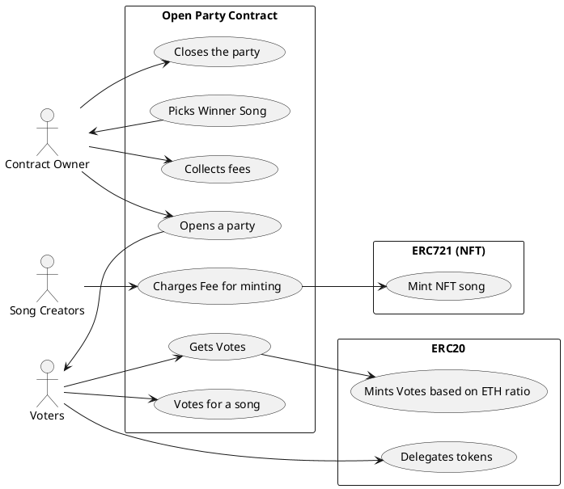
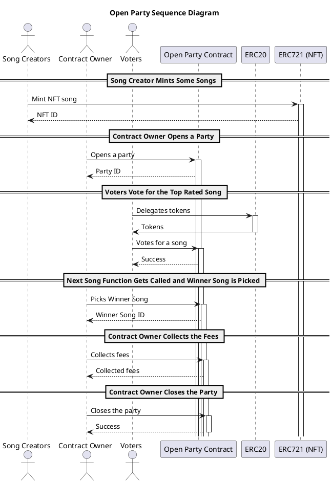

# Decentralized Open Party (DOP)

:::info
#### Table of Contents
[TOC]
:::

## Abstract

A Smart Contract that mints Songs as NFTs (ERC721) that are copyleft submitted by their creators and approved by paying a fee in an ERC20 Token Which can also be used to vote which song should be player after in a decentralized application the Contract Owner starts or finish a party which is followed by voting rounds and the top voted song is selected as winner.

## Motivation

Currently, there are lots of implementations of music dapps but most of them do not include a tokenomics model that provides incetives to all the usecase actors and full control over the DAPP descision making. Through this DAPP we propose to forefill these usecases in a fun way, which incentivize creativity in a free and colaborative way.

## Implementation
> Note: the first version takes multiple code and ideas developed during the Encode Club Bootcamp to forefill the achieve the basic goals and deploy the project on time, this is because we are unsure who will help us on developing the project from our team. 

>There are future ideas and implementations that might be done in future sprints and versions after the final project which will be only specified but not developed.

OpenParty is a decentralized jukebox that allows users to vote for their favorite songs and plays the song with the most votes next. The contract has the following features:

* Users can purchase votes using ETH. The amount of votes they receive is based on the amount of ETH paid and the purchase ratio set by the contract owner.
* Users can mint a song using the OPSongs token by paying a fee in vote tokens. The song metadata is stored on IPFS, and the token ID of the song is returned to the user.
* Users can burn votes to receive ETH in return.
* The owner of the contract can burn a song token if necessary.
* The owner of the contract can update the song fee if necessary.
* The owner of the contract can open and close voting periods. During a voting period, users can vote for songs using their voting power, which is based on the number of vote tokens they hold. The song with the most votes at the end of the voting period will be played next.

 
## Use Case:


Img 1. Shows the Open Party Use Cases

* **Actors**: There are three actors in the system: "Contract Owner" (CO), "Voters" (V), and "Song Creators" (SC).
* **Open Party Contract**: This is the main rectangle representing the open party contract, which contains all the use cases that are part of the contract.
* **Use Cases**: There are seven use cases in the "Open Party Contract" rectangle:
    * **Opens a party (UC1)**: The contract owner initiates this use case by opening a party, which allows voters to start voting for their favorite songs.
    * **Votes for a song (UC2)**: The voters participate in this use case by voting for their favorite songs in the party.
    * **Picks Winner Song (UC3):** Once the voting period is over, the contract owner selects the winner song based on the votes received from the voters.
    * **Collects fees (UC4):** The contract owner collects the fees from the song creators for participating in the party.
    * **Closes the party (UC5)**: The contract owner closes the party once the winner song has been selected.
    * **Charges Fee for minting (UC6)**: The song creators can mint their songs as NFTs and charge a fee for it using this use case.
    * **Gets Votes (UC7)**: The voters get votes based on their participation and the amount of ERC20 tokens delegated to them.
* **ERC721 (NFT)**: This rectangle represents the use case of minting NFTs (Non-Fungible Tokens) for the songs that are part of the party.
* **Mint NFT song (UCNFT1)**: The song creators can mint their songs as NFTs using this use case.
* **ERC20**: This rectangle represents the use cases related to ERC20 tokens, which are used as votes in the party.
* **Mints Votes based on ETH ratio (UCVotes1)**: This use case represents the conversion of ETH (Ethereum) to ERC20 tokens, which can be used as votes.
* **Delegates tokens (UCVotes2)**: This use case allows voters to delegate their ERC20 tokens to other voters or themselves to gain more votes.


## Sequence Diagram

Img 2. Shows the Open Party sequence diagram

Sequence diagram Img2. shows:

The sequence diagram shows the interactions between the actors and participants in the Open Party contract. The actors are Song Creators, Contract Owner, and Voters, and the participants are Open Party Contract, ERC20, and ERC721 (NFT).

The steps involved in the process are:

* Song Creator mints some songs by sending a request to the ERC721 (NFT) participant. The NFT participant responds with an NFT ID. 
* Contract Owner opens a party by sending a request to the Open Party Contract participant. The Open Party Contract participant responds with a Party ID.
* Voters delegate tokens by sending a request to the ERC20 participant. The ERC20 participant responds with tokens. The voter then votes for a song by sending a request to the Open Party Contract participant. The Open Party Contract participant responds with a success message.
* When all votes have been cast, the Contract Owner calls the "Picks Winner Song" function by sending a request to the Open Party Contract participant. The Open Party Contract participant responds with the Winner Song ID.
* The Contract Owner collects fees by sending a request to the Open Party Contract participant. The Open Party Contract participant responds with the collected fees.
* Finally, the Contract Owner closes the party by sending a request to the Open Party Contract participant. The Open Party Contract participant responds with a success message.


## Tokenomics (Bussiness Model)


The business model consists of an Aragon DAO with our ERC20, where actors involved can submit proposals. This token is for governance and allows participation, decision-making, and payments for the development of plugins (DEFI Integrations) that give investment returns to those who Minted Songs or Vote Tokens. If the investor is not satisfied with the business model or the project for any reason, or for any reason wants to exit, they can burn their tokens and redeem the equivalent percentage of the amount they invested, which avoids legal problems because it is a governance token that has their assets in the equivalent percentage of their contribution, and they control their share of the DAO.


### The DOP token Distribution (proposal): 

DPL Tokenomics Distribution Table

| Developers | DAO Vault (33% Liquidity DEX) | OnRamp DAO Investors |
| -------- | -------- | -------- |
| 9.9%     | 50.1%     |  40%    |

> Note. It is well known that a cryptocurrency to be considered truthly decentralized (also considered by some US Institutions)no holder SHOULD NOT own more than 10%, that is why we must incentivice to provide also liquitidy to DEX and other methods that ensure the a proper decentralized RET Token distribution.


### Governance (Quadratic Voting with Snapshot.org)

ToDo

## Future Implementations
Our main idea was to create a tokenomics model for a playlist music where everyone can propose a playlists or plalist for diferent genres and that we can incentive Musicians to opensource their music plus adding incentives to all participants.

* Implement ownable (Handled by DAO)
* Implement ERC721 with properties for a song
* Implement ERC20 with burning and Minter properties
* Implement Decentralized Free Playlist smart contract that owns bouth ERC721 and ERC20.
* The DAO define PlayList Types and fee
* The DAO starts Playlist type:
  * Define a block timestamp target for all the playlists to be submitted at that specific music type (example: Rock)
* Music Creators and Playlists Creators must buy an ERC20 with ETH
* Music creators can submit songs as NFTs with specific properties at anytime
  * Token Holders should vote for approval throught the DAO
  * The DAO must verify there is no CopyRight infrigment
  * To avoid spam there is a fee for submitting a Song as NFT
* Playlist creators submit playlists based on all the already existing NFTs
  * To avoid spam there is a fee for submitting a Playlist
  * Only possible before block timestamp met
* Anyone can roll for the playlist winner
  * Only after block timestamp target is met
* Winner Playlist will get the pooled ERC20 of all the playlists submitted minus fee
  * The 35% of the Pooled ERC20 goes to the Top 1 Playlist Music Creators
  * The 20% of the Pooled ERC20 goes to the Top 1. Playlist Creator.
  * The 15% of the Pooled ERC20 goes to the Top 2. NFTs playlist (Music Creators)
  * the 10% of the Pooled ERC20 goes to the Top 2. Playlist Creator.
  * The 10% of the Pooled ERC20 goes to the Top 3. NFTs playlist (Music Creators)
  * the 5% of the Pooled ERC20 goes to the Top 3. Playlist Creator.
  * 5% of the Pooled ERC20 are given as fees to the DAO.
* the DAO can withdraw fees and restart Playlist Type
* Token owners can burn ERC20 tokens and redeem ETH


## Contact and Developers

- [David E. Perez Negron Rocha](mailto:david@neetsec.com)
- [Daniel Poreda]()


## References

[1] Encode Club Solidity Bootcamp , “Lesson 12 - Tokenized Votes”, https://github.com/Encode-Club-Solidity-Bootcamp/Lesson-12, 2023.
[2] Encode Club Solidity Bootcamp , “Lesson 20 - Lottery”, https://github.com/Encode-Club-Solidity-Bootcamp/Lesson-20, 2023.
[3] docs.soliditylang.org , “Solidity by Example”, https://docs.soliditylang.org/en/latest/solidity-by-example.html#voting, 2023.

## Copyright
```
Copyright (C) David Eugenio Perez Negron Rocha, Daniel Poreda.  
Permission is granted to copy, distribute and/or modify this document
under the terms of the GNU Free Documentation License, Version 1.3
or any later version published by the Free Software Foundation;
with no Invariant Sections, no Front-Cover Texts, and no Back-Cover Texts.
A copy of the license is included in the section entitled "GNU
Free Documentation License". 
```